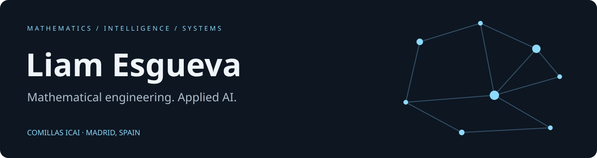

[LinkedIn](https://www.linkedin.com/in/liamesgueva/) · [All repositories](https://github.com/liiiaamm?tab=repositories)

I study **Mathematical Engineering & Artificial Intelligence at Comillas ICAI (2023–2027)** and build systems that connect mathematical models with working software. My experience includes AI work at **Kearney** and time-series research at **Finaipro**.

My interests span **LLM knowledge systems, deep learning, quantitative modeling, and autonomous robotics**.

## Selected projects · try the code

These are jointly developed projects. My portfolio editions preserve the original teams' attribution and add accessible demos and documentation.

### Autonomous Navigation Lab

**Particle-filter localization · Probabilistic roadmaps · Pure-pursuit control · ROS 2**

A mobile-robot navigation stack with simulation and TurtleBot3 workspaces. Explore the original controller through a lightweight browser demo, without installing ROS.

[Explore repository and run the demo →](https://github.com/liiiaamm/LabRobotsMovilesAutonomos#try-the-controller-without-ros)

### Hologram Lab

**Computer vision · OpenCV · PCA · Augmented reality**

Geometric pattern recognition, base tracking and procedural hologram rendering. The interactive demo runs the original detector and renderer on synthetic input, without a camera.

[Explore repository and run the demo →](https://github.com/liiiaamm/Hologram_AugmentedReality#try-the-camera-free-demo)

## More to explore

| Project | Focus |
| --- | --- |
| [How to Train Your Perceptron](https://github.com/liiiaamm/How-To-Train-Your-Perceptron) | Co-developed interactive explanation of perceptron learning for AND / OR gates |
| [GraphNav](https://github.com/liiiaamm/GraphNav) | Graph algorithms and a Madrid street-navigation prototype |
| [RSA Lab](https://github.com/liiiaamm/RSA-Lab) | Educational cryptography and number theory |
| [PyBashOS](https://github.com/liiiaamm/PyBashOS) | Linux automation and multiprocessing experiments |

<strong>Machine learning foundations & coursework</strong>

| Repository | Topic |
| --- | --- |
| [k-nearest neighbors](https://github.com/liiiaamm/ml-knn) | Classification from distance-based neighborhoods |
| [Linear regression](https://github.com/liiiaamm/ml-linear-regression) | Regression implementation and experiments |
| [Regression lab 2.4](https://github.com/ICAI-IMAT-ML/p2-4-liiiaamm) | Further linear-regression coursework |
| [Logistic regression & regularization](https://github.com/ICAI-IMAT-ML/p2-5-liiiaamm-1) | Classification and regularization |
| [Cross-validation](https://github.com/ICAI-IMAT-ML/p2-6-liiiaamm) | Model evaluation coursework |
| [ML lab 2.5](https://github.com/ICAI-IMAT-ML/p2-5-liiiaamm) | Additional machine-learning coursework |
| [ML lab 2.8](https://github.com/ICAI-IMAT-ML/p2-8-liiiaamm) | Additional machine-learning coursework |
| [Modular arithmetic](https://github.com/liiiaamm/Aritmetica-Modular) | Early number-theory exercises |
| [HTTP server](https://github.com/liiiaamm/Practica_1_DAS) | A minimal Python HTTP server |

Coursework repositories retain the teaching material and original attribution. They complement the larger projects above.

## Toolkit

**Build:** Python · SQL · Bash · C# · R · MATLAB  
**Model:** PyTorch · scikit-learn · LangChain · LangGraph  
**Ship:** Git · Docker · AWS · Google Cloud

## Beyond code

Co-founder and external advisor of the **ICAI Quantitative Finance Club**, and board member of the **Comillas PE & VC Club**. Interested in economics, quantitative finance and mountain sports.

Spanish native speaker · English C1 · [Let's connect on LinkedIn](https://www.linkedin.com/in/liamesgueva/)
